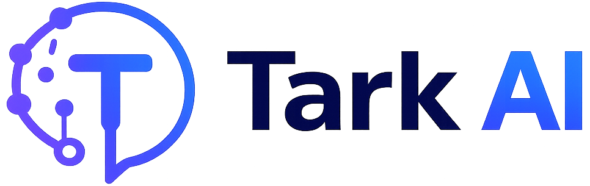

<p align="center">
  
</p>

<h1 align="center">🚀 Tark AI</h1>

<p align="center">
  <strong>Talk. Learn. Build.</strong><br>
  Chat with AI personas that think, teach, and communicate like your favorite software engineers.
</p>

<p align="center">
  
  
  
  
  
  
</p>

<p align="center">
  <a href="#live-demo">Live Demo</a> •
  <a href="#features">Features</a> •
  <a href="#architecture">Architecture</a> •
  <a href="#persona-data-collection">Persona Data</a> •
  <a href="#prompt-engineering">Prompt Engineering</a> •
  <a href="#getting-started">Getting Started</a>
</p>

---

# 🌐 Live Demo

**Website**

https://tark-ai.online

**GitHub**

https://github.com/heelpatel01/tark-ai

---

# 📖 About

Tark AI is an AI-powered persona chat application built for the **GenAI with JavaScript 2026 Cohort Assignment**.

Instead of creating a generic chatbot, Tark AI recreates the communication style, teaching philosophy, reasoning process, and technical expertise of well-known software educators.

Currently supported personas:

- ☕ Hitesh Choudhary
- 🚀 Piyush Garg

The goal is **not simply to imitate catchphrases**.

Instead, the system focuses on reproducing how these educators **think, teach, solve engineering problems, communicate with students, and explain difficult concepts**.

---

# 🧩 AI Tool Calling & Chat Branching

> Extension for the **ChaiGPT Streaming Assignment**. Both features are built *on top* of the existing streaming architecture — no rewrite, no new backend service, no heavy database.

## Overview

Two production-grade capabilities were layered onto Tark AI:

1. **Real Gemini function calling** — the model itself decides, per turn, whether it needs live information. When it does, it invokes a `searchWeb` tool; the result streams back and generation continues naturally, all inside the same chat stream. If the model already knows the answer, no tool is called.
2. **ChatGPT-style branching** — any message can become the fork point for a new, independently-continuing conversation branch, with switch / rename / delete, persisted across reloads.

The token-by-token streaming experience, the persona system, the thinking indicator and the entire UI are unchanged.

## Tool Calling Flow

```
User ──▶ Gemini ──▶ "Do I need live data?"
                          │
              ┌───────────┴───────────┐
              │ no                     │ yes
              ▼                        ▼
        stream answer            searchWeb(query)      ← real function call
                                       │
                                 Tavily provider
                                       │
                                 tool result ──▶ Gemini continues ──▶ final answer streams
```

- The decision is made by Gemini via the AI SDK's native tool calling (`streamText({ tools, stopWhen: stepCountIs(5) })`) — **never simulated with prompt hacks**.
- Tool activity is surfaced inline in chat (no modal / popup):

  ```
  🌐  Searching Web...
  Searching: "latest AI news"
  ✓  Search Complete
  ```

- **Reusable tool layer** (`lib/tools/`): `schemas.ts` (zod input) → `search.ts` (provider-agnostic; **Tavily** by default, swappable) → `executor.ts` (normalizes result for the model + a display summary) → `registry.ts` (builds the Gemini `tools` object).
- **Graceful failure**: if search fails or `TAVILY_API_KEY` is missing, the chat shows *"Unable to retrieve live information."* and Gemini answers from its own knowledge. It never crashes.
- **Persistence**: tool events are stored as ordinary chat messages (`role: "tool"`, `tool`, `query`, `result`). No `ToolCalls` / `ToolResponses` tables, no event sourcing.

The single response is streamed as **NDJSON events** (`{type:"text"|"tool"|"error"}`) so one stream carries both assistant tokens and tool activity while preserving the original smooth cadence.

## Branching Flow

```
Main     A ─ B ─ C ─ D
              │
              └── Branch:  A ─ B ─ X ─ Y      (forked from B)
```

Opening a branch loads **the original messages up to `parentMessageId` + that branch's own messages**. Both threads continue independently.

- Hover any message ▸ **⋮** ▸ **Create Branch**.
- Branches appear nested under their conversation in the sidebar with **Switch · Rename · Delete** (the root *Main* branch can't be deleted).
- Thread reconstruction walks the parent chain, so nested branches inherit correctly.

## Data Model (intentionally tiny)

Persisted client-side in `localStorage` (`services/persistence.ts`) — works on serverless with zero backend, migrations or extra env vars, and upgrades the previously in-memory history to survive reloads.

| Entity | Fields |
| --- | --- |
| **Conversation** | `id`, `title`, `personaKey`, `currentBranchId`, `createdAt` |
| **Branch** | `id`, `conversationId`, `name`, `parentMessageId` (null → *Main*), `createdAt` |
| **Message** | `id`, `conversationId`, `branchId`, `role` (`user`\|`assistant`\|`tool`), `content`, `createdAt` (+ `tool`/`query`/`result` for tool messages) |

## New Architecture Map

```
lib/tools/        schemas · search (Tavily, replaceable) · executor · registry
services/         persistence (localStorage store) · chatClient (NDJSON transport)
hooks/            useConversations (state + branching) · useChat (send/stream orchestration)
components/
  chat/           Markdown · MessageBubble
  tool/           ToolEvent   (🌐 in-chat search card)
  branch/         BranchMenu  (⋮ create branch) · BranchList (sidebar switch/rename/delete)
types/chat.ts     Message · Conversation · Branch · StreamEvent
app/api/gemini/   route.ts    (function calling + NDJSON event stream)
```

---

# ✨ Features

## 🤖 AI Persona Conversations

- Chat with multiple AI personas
- Persona switching
- Real-time streaming responses
- Context-aware conversations
- Natural multi-turn memory
- Markdown rendering
- Syntax highlighted code blocks

---

## 🎭 Authentic Persona Simulation

Each persona contains:

- Personality
- Communication Style
- Tone
- Technical Expertise
- Teaching Philosophy
- Public Background
- Additional Context
- 30+ Few-shot Interaction Examples

This allows the model to produce highly consistent responses.

---

## 💬 Smart Conversations

- Context-aware replies
- Step-by-step technical explanations
- Practical engineering advice
- Real-world analogies
- Production-oriented recommendations

---

## 🎨 Modern UI

- Neo-Brutalist Design
- Fully Responsive
- Streaming Chat Experience
- Smooth Animations
- Clean Mobile Layout

---

# 🎭 Personas

| Persona | Expertise |
|----------|-----------|
| **Hitesh Choudhary** | Full Stack Development, JavaScript, Python, AI, Cybersecurity, Teaching, Entrepreneurship |
| **Piyush Garg** | Generative AI, Backend Engineering, System Design, Node.js, AI Agents, Startups, Teachyst |

---

# 🏗 Architecture

```text
                     User
                       │
                       ▼
             Next.js Frontend
                       │
                       ▼
             Persona Selection
                       │
                       ▼
      Dynamic Persona System Prompt
                       │
                       ▼
          Conversation History
                       │
                       ▼
         Google Gemini 2.5 Flash
                       │
                       ▼
           Streaming AI Response
```

---

# 🧠 Persona Data Collection

Persona profiles were created using **only publicly available information**.

Sources included:

- YouTube Videos
- Live Streams
- Twitter / X
- Public Interviews
- Blogs
- Portfolio Websites
- Course Platforms
- Public Documentation

The collected information was manually analyzed and transformed into structured persona profiles.

Each profile contains:

- Communication Style
- Personality
- Tone
- Teaching Philosophy
- Engineering Mindset
- Public Biography
- Technical Expertise
- Additional Context
- Few-shot Interaction Examples

**No private or confidential information was used.**

---

# 📝 Prompt Engineering

Every request begins with a dynamically generated system prompt.

The prompt combines:

- Persona Identity
- Personality
- Communication Style
- Tone
- Expertise
- Response Rules
- Response Quality Rules
- Additional Context
- Few-shot Interaction Examples

Rather than asking the model to simply **"act like"** someone, the prompt encourages the model to reproduce the educator's:

- reasoning process
- teaching methodology
- engineering mindset
- communication style
- problem-solving approach

This produces significantly more natural and authentic conversations.

---

# 💬 Context Management

Conversation history is preserved by sending previous messages with every request.

Each inference includes:

- Dynamic Persona System Prompt
- Previous Conversation
- Latest User Message

This allows the model to:

- remember previous questions
- answer follow-up queries naturally
- maintain persona consistency
- avoid repetitive introductions

---

# ⚙ Tech Stack

## Frontend

- Next.js 16
- React 19
- TypeScript
- Tailwind CSS

## AI

- Vercel AI SDK
- Google Gemini 2.5 Flash

## Markdown

- React Markdown
- Remark GFM
- React Syntax Highlighter

## Deployment

- Vercel

---

# 📂 Project Structure

```text
tark-ai/
│
├── app/
│   ├── api/
│   │   ├── gemini/
│   │   ├── groq/
│   │   ├── gpt/
│   │   ├── gpt-oss/
│   │   └── qwen/
│   │
│   ├── chat/
│   ├── persona/
│   └── page.tsx
│
├── component/
│
├── lib/
│   ├── personaData.ts
│   └── personaInfo.ts
│
├── public/
│
└── README.md
```

---

# 💡 Sample Conversations

## Hitesh Choudhary

**User**

> Sir, AI will replace software engineers?

**Assistant**

> Haanji... AI ek powerful tool hai. Lekin tool chalane ke liye engineer chahiye. Fundamentals strong rakhiye. Framework badlenge, AI badlegi, engineering nahi badlegi. Problem solving seekhiye aur real projects banaiye.

---

## Piyush Garg

**User**

> Is Node.js dead?

**Assistant**

> Dekho, Node.js dead nahi hai. Titles curiosity create karte hain. Reality ye hai ki ecosystem evolve ho raha hai. Better runtimes aa rahe hain, tooling improve ho rahi hai, lekin engineering wahi hai. Technology ko context ke saath samjho.

---

# 🚀 Getting Started

## Prerequisites

- Node.js 18+
- npm

---

## Clone Repository

```bash
git clone https://github.com/heelpatel01/tark-ai.git

cd tark-ai
```

---

## Install Dependencies

```bash
npm install
```

---

## Environment Variables

Create

```
.env.local
```

Add

```env
# Required — Google Gemini (note the double "Y")
GEMINI_API_KEYY=YOUR_GEMINI_API_KEY

# Optional — enables the searchWeb tool (falls back gracefully if absent)
TAVILY_API_KEY=YOUR_TAVILY_API_KEY
```

| Variable | Required | Purpose |
| --- | --- | --- |
| `GEMINI_API_KEYY` | ✅ | Gemini 2.5 Flash streaming + function calling |
| `TAVILY_API_KEY` | ⭕ | Live web search for the `searchWeb` tool. Without it, search degrades gracefully. |

---

## Start Development Server

```bash
npm run dev
```

Open

```
http://localhost:3000
```

---

# 📸 Screenshots

> _Placeholders — drop images into `public/` and update the paths._

| Streaming chat | 🌐 Web search (tool calling) | Chat branching |
| --- | --- | --- |
| `public/screenshot-chat.png` | `public/screenshot-tool.png` | `public/screenshot-branch.png` |

---

# 📈 Future Improvements

- ✅ ~~Tool Calling~~ (shipped — `searchWeb` via Gemini function calling)
- ✅ ~~Chat Branching~~ (shipped — ChatGPT-style branches)
- Additional tools (calculator, code execution, docs retrieval)
- Server-side persistence (Postgres/Prisma) as a drop-in for the localStorage store
- Custom Persona Builder
- Voice Conversations
- Long-Term Memory
- Image Understanding
- MCP Integration
- RAG Support
- Persona Marketplace
- Workspace Mode
- Team Collaboration

---

# 👨‍💻 Author

**Heel Patel**

Full Stack Developer & AI Engineer

GitHub

https://github.com/heelpatel01

Portfolio

cortax.in

---

# 🙏 Acknowledgements

Special thanks to:

- Hitesh Choudhary
- Piyush Garg
- Chai Code
- Vercel AI SDK Team
- Google Gemini

for building incredible learning resources and open AI tooling that inspired this project.

---

# 📄 License

This project is licensed under the **MIT License**.

---

<p align="center">

Built for the GenAI with JavaScript 2026 Cohort.

</p>