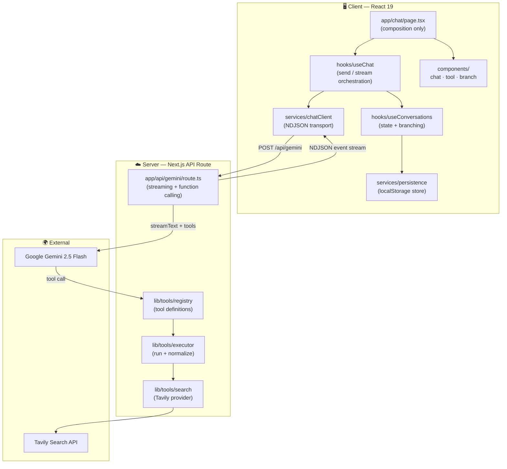
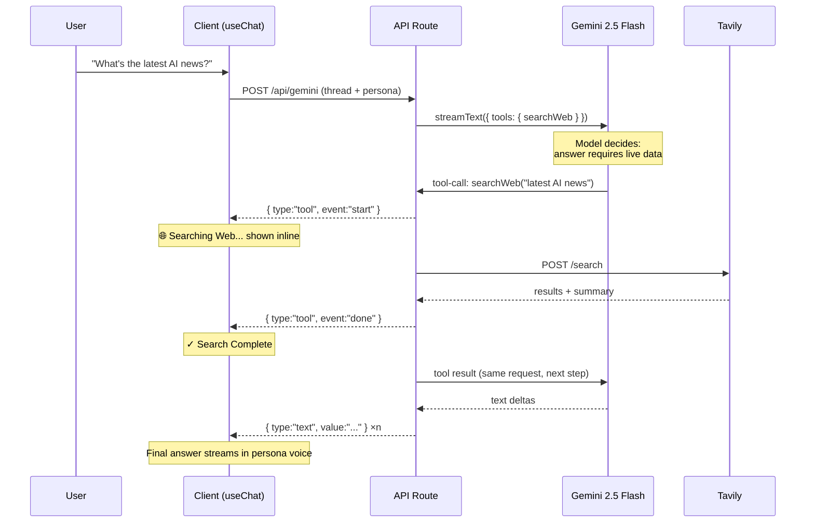
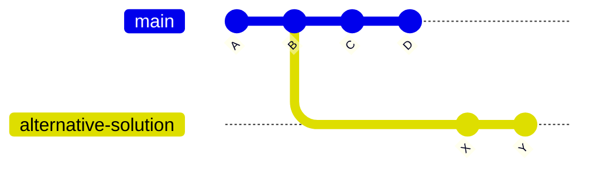
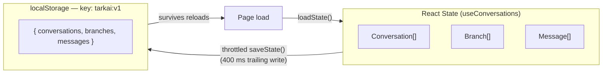
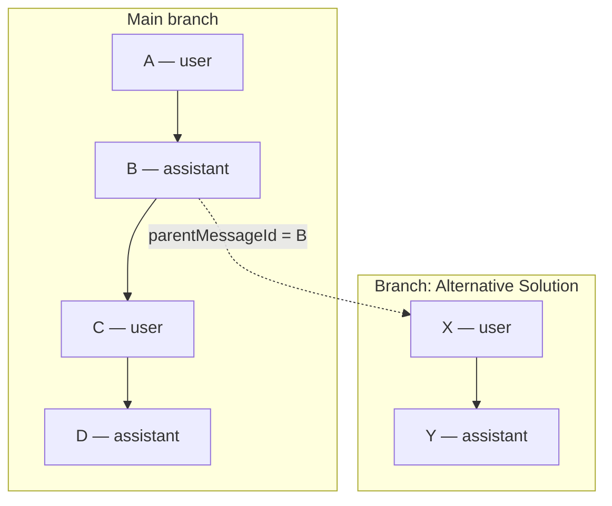
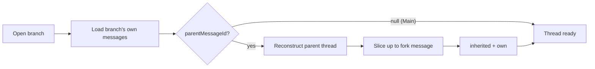

<p align="center">
  
</p>

<h1 align="center">Tark AI</h1>

<p align="center">
  <strong>Talk. Learn. Build.</strong><br>
  A production-grade AI mentor platform with streaming personas, real Gemini function calling, live web search, and ChatGPT-style conversation branching.
</p>

<p align="center">
  Tark AI recreates the communication style, teaching philosophy, and reasoning process of well-known software educators. Instead of imitating catchphrases, it reproduces how these mentors <em>think</em> — then layers modern AI application engineering on top: token-by-token streaming, model-driven tool invocation, inline web search, and branchable conversation threads that persist across sessions.
</p>

<p align="center">
  
  
  
  
  
  
  
</p>

<p align="center">
  <a href="#-features">Features</a> •
  <a href="#-preview">Preview</a> •
  <a href="#-architecture">Architecture</a> •
  <a href="#-new-features-added">New Features</a> •
  <a href="#-tech-stack">Tech Stack</a> •
  <a href="#-installation">Installation</a> •
  <a href="#-how-tool-calling-works">Tool Calling</a> •
  <a href="#-how-chat-branching-works">Branching</a>
</p>

---

## ✨ Features

| Feature | Description |
| --- | --- |
| 🤖 **AI Personas** | Chat with mentors modeled on Hitesh Choudhary and Piyush Garg — reasoning style, Hinglish tone, teaching philosophy, and humor included |
| ⚡ **Streaming Responses** | Token-by-token streaming with a smooth, natural cadence |
| 🔧 **Real Gemini Function Calling** | The model itself decides when it needs live data — native tool calling, never prompt-simulated |
| 🌐 **Live Web Search** | `searchWeb` tool powered by Tavily, rendered inline in the chat with search status |
| 🌿 **Chat Branching** | Fork a conversation from any message, ChatGPT-style; branches continue independently |
| 📝 **Markdown Rendering** | Full GFM support — syntax-highlighted code blocks, copyable tables, blockquotes, links |
| 💾 **Persistent Conversations** | Conversations, branches, and messages survive page reloads with zero backend setup |
| 📱 **Responsive Design** | Fully usable from mobile to widescreen, with an adaptive slide-in sidebar |
| 🌗 **Dark / Light Theme** | One-click theme toggle applied consistently across the entire app |
| 🎨 **Modern UI** | Glassmorphism surfaces, accent-tinted persona theming, subtle motion design |
| 💭 **Thinking Indicator** | Mentor avatar + animated dots shown only after 180 ms — no empty assistant bubbles, hidden the instant streaming begins |
| 🔁 **Persona Switcher** | Swap mentors mid-session from a glass dropdown without leaving the chat |
| 🛡️ **Graceful Degradation** | Search failures never crash the app — the model continues from its own knowledge |

---

## 📸 Preview

[attach image: Landing Page]

[attach image: Chat Interface]

[attach image: Tool Calling]

[attach image: Branch Creation]

[attach image: Branch Navigation]

[attach image: Mobile View]

---

## 🏗 Architecture

Tark AI is a **Next.js App Router** application with a clean separation between the transport, state, and presentation layers. All AI work happens server-side in a streaming API route; the client consumes a typed event stream and owns conversation state through dedicated hooks.



### Tool Calling Flow



If the model already knows the answer, the `tool-call` step simply never happens — it streams the response directly.

### Chat Branching Flow



A branch forks at any message (`parentMessageId`). Opening a branch reconstructs its thread as **inherited history up to the fork point + the branch's own messages** — so the branch above reads `A → B → X → Y` while Main still reads `A → B → C → D`. Both continue independently.

### Conversation Persistence Flow



Three flat collections. No `ToolCalls` table, no `ToolResponses` table, no event sourcing, no recursive trees — tool events are stored as ordinary messages with `role: "tool"`.

---

## 🚀 New Features Added

### Phase 1 — AI Tool Calling

**How Gemini decides.** The `searchWeb` tool is registered with the Vercel AI SDK's native function-calling interface (`streamText({ tools, stopWhen: stepCountIs(5) })`). The tool's description and a system-prompt policy teach the model a clear contract: rely on its own knowledge by default, and invoke `searchWeb` **only** when the answer genuinely depends on live or post-training information — today's news, current prices, latest releases, sports scores, weather. The decision is entirely the model's; there is no prompt simulation, no keyword matching, no heuristics on the server.

**Streaming.** The original token-by-token streaming is preserved. The API route consumes Gemini's `fullStream` and emits **newline-delimited JSON events** (`text`, `tool start/done/error`) over a single response, so one stream carries both assistant tokens and tool activity. On the client, tool activity renders inline in the chat — `🌐 Searching Web...` → `Searching: "query"` → `✓ Search Complete` — with no popup and no modal, and then the answer keeps streaming naturally.

**Persistence.** Tool events reuse the existing message persistence: they are stored as chat messages with `role: "tool"` plus `tool`, `query`, and `result` fields. Reopening a conversation replays the full timeline, search cards included.

**Graceful fallback.** Every failure mode — missing API key, HTTP error, timeout, empty results — resolves to a normalized "search unavailable" result instead of throwing. The chat shows *"Unable to retrieve live information."* and Gemini continues the answer from its own knowledge. The stream never crashes.

### Phase 2 — Chat Branching

**Branching.** Hover any message and a `⋮` menu appears; **Create Branch** forks the conversation at exactly that message. The new branch becomes active immediately and continues independently from Main.

**History reconstruction.** Each branch stores only its *own* messages plus a single `parentMessageId` pointer. Opening a branch walks the parent chain: it loads the parent thread up to (and including) the fork message, then appends the branch's own messages. Nested branches (a branch of a branch) inherit correctly through the same recursive walk.

**Persistence.** Branches live in the same minimal store as everything else — `Conversation`, `Branch`, `Message` — persisted to `localStorage` and rehydrated on load. The conversation tracks its `currentBranchId`, so reopening a session lands you on the branch you left.

**Branch navigation.** Branches are listed in the sidebar, nested under their conversation, with the same glassmorphism styling as the rest of the app. Each branch supports **Switch**, **Rename** (inline edit), and **Delete** — the root *Main* branch is protected from deletion, and deleting the active branch falls back to Main.

---

## 🧠 Tech Stack

| Category | Technology | Purpose |
| --- | --- | --- |
| Framework | **Next.js 16** (App Router, Turbopack) | Full-stack React framework, streaming API routes |
| Language | **TypeScript 5** (strict) | End-to-end type safety, shared domain types |
| UI Library | **React 19** | Component model, hooks |
| Styling | **Tailwind CSS v4** | Utility-first styling, glassmorphism design system |
| AI SDK | **Vercel AI SDK v5** (`ai`, `@ai-sdk/google`) | Streaming, native function calling, multi-step tool loops |
| LLM | **Google Gemini 2.5 Flash** | Persona responses + tool-call decisions |
| Web Search | **Tavily** | Live search provider behind the `searchWeb` tool |
| Validation | **Zod** | Tool input schemas shared between registry and executor |
| Markdown | **react-markdown + remark-gfm** | GFM rendering of assistant responses |
| Code Highlighting | **react-syntax-highlighter** (Prism) | Syntax-highlighted, copyable code blocks |
| Icons | **react-icons** (Feather) | Consistent icon set |
| Persistence | **localStorage** | Zero-backend conversation/branch/message store |
| Deployment | **Vercel** | Serverless hosting with edge-friendly streaming |

---

## 📂 Folder Structure

```
tark-ai/
├── app/
│   ├── api/
│   │   └── gemini/
│   │       └── route.ts          # Streaming route: persona prompt + function calling + NDJSON events
│   ├── chat/
│   │   └── page.tsx              # Chat screen — composes hooks and components (no business logic)
│   ├── persona/
│   │   └── page.tsx              # Persona selection screen
│   ├── layout.tsx                # Root layout, fonts, theme
│   ├── globals.css               # Design system: glass surfaces, dark-mode overrides, animations
│   └── page.tsx                  # Landing page
│
├── components/                   # New feature components (small, single-purpose)
│   ├── chat/
│   │   ├── Markdown.tsx          # GFM renderer: code blocks with copy, tables with copy
│   │   └── MessageBubble.tsx     # One chat row: bubbles, hover actions, branch menu
│   ├── tool/
│   │   └── ToolEvent.tsx         # Inline 🌐 web-search card (running / done / error states)
│   └── branch/
│       ├── BranchMenu.tsx        # Hover "⋮" → Create Branch
│       └── BranchList.tsx        # Sidebar branch list: switch / rename / delete
│
├── component/                    # Original UI components (pre-existing)
│   ├── ChatSidebar.tsx           # Sidebar: mentor card, sessions, branches, quick topics
│   ├── cardPersona.tsx           # Persona selection card
│   ├── hero.tsx / navbar.tsx     # Landing page sections
│   └── ThemeToggle.tsx / ThemeLogo.tsx
│
├── hooks/
│   ├── useChat.ts                # Orchestrates a send: user msg → stream → tool events → assistant msg
│   ├── useConversations.ts       # Single owner of conversation/branch/message state + persistence
│   └── useTheme.ts               # Dark / light theme state
│
├── services/
│   ├── chatClient.ts             # NDJSON transport: fetch, parse, dispatch typed stream events
│   └── persistence.ts            # localStorage store + branch thread reconstruction
│
├── lib/
│   ├── tools/                    # Reusable tool layer
│   │   ├── schemas.ts            # Zod input schemas + normalized result types
│   │   ├── search.ts             # SearchProvider interface + Tavily implementation (swappable)
│   │   ├── executor.ts           # Runs tools, formats output for model vs. UI
│   │   └── registry.ts           # Builds the Gemini function-calling tools object
│   └── personaData.ts            # Server-side persona system prompts + few-shot examples
│
├── types/
│   └── chat.ts                   # Message · Conversation · Branch · StreamEvent (single source of truth)
│
├── type/
│   └── personaInfo.ts            # Frontend persona display metadata
│
└── public/                       # Logos, persona images, static assets
```

| Folder | Responsibility |
| --- | --- |
| `app/api/gemini` | The only place AI requests happen — persona prompt assembly, function calling, event streaming |
| `lib/tools` | Provider-agnostic tool layer; add a tool by adding one registry entry |
| `services` | Framework-free logic: transport and storage, independently testable |
| `hooks` | React state ownership; components stay presentational |
| `components` | Small feature components grouped by domain (chat / tool / branch) |
| `types` | Shared domain types used by client, server, and storage |

---

## ⚙ Environment Variables

| Variable | Required | Description |
| --- | --- | --- |
| `GEMINI_API_KEYY` | ✅ Yes | Google Gemini API key (note the intentional double "Y" — it matches `process.env.GEMINI_API_KEYY` in the codebase). Powers streaming and function calling. |
| `TAVILY_API_KEY` | ⭕ Optional | Enables the `searchWeb` tool via [Tavily](https://tavily.com). Without it, search degrades gracefully — the chat shows *"Unable to retrieve live information."* and continues from model knowledge. |

Create a `.env.local` (or `.env`) in the project root:

```env
GEMINI_API_KEYY=your_google_gemini_api_key
TAVILY_API_KEY=your_tavily_api_key
```

A template is provided in [`.example.env`](.example.env).

---

## 🛠 Installation

### Prerequisites

- Node.js 18.18+ (Node 20 recommended)
- npm
- A [Google AI Studio](https://aistudio.google.com/) API key
- A [Tavily](https://tavily.com) API key (optional, for live search)

### Clone

```bash
git clone https://github.com/heelpatel01/tark-ai.git
cd tark-ai
```

### Install

```bash
npm install
```

### Configure

```bash
cp .example.env .env.local
# then fill in your keys
```

### Run

```bash
npm run dev
```

Open [http://localhost:3000](http://localhost:3000).

### Build

```bash
npm run build
npm start
```

### Deploy

The app deploys to [Vercel](https://vercel.com) with zero configuration:

1. Import the repository in the Vercel dashboard.
2. Add `GEMINI_API_KEYY` (and optionally `TAVILY_API_KEY`) under **Project → Settings → Environment Variables**.
3. Deploy. Streaming and function calling work out of the box on serverless functions — no database provisioning required.

---

## 💡 How Tool Calling Works

Tark AI uses **real Gemini function calling** through the Vercel AI SDK — the model receives a machine-readable tool definition and autonomously emits structured tool calls when it decides one is needed.

**1 — Registration.** `lib/tools/registry.ts` builds a `ToolSet` where `searchWeb` is declared with a Zod input schema (`{ query: string }`) and an `execute` function. The description encodes the usage policy: *fresh, real-time, post-training-cutoff information only*. This is what lets the model stay idle for questions it can already answer.

**2 — Decision.** The API route calls `streamText({ model, messages, tools, stopWhen: stepCountIs(5) })`. Gemini evaluates each turn: a question like *"Explain React hooks"* streams a direct answer; *"What happened in AI this week?"* emits a `tool-call` part with a model-chosen query.

**3 — Execution.** The SDK invokes `execute`, which routes through `lib/tools/executor.ts` → `lib/tools/search.ts`. The Tavily provider runs the search with an 8-second timeout and returns a normalized result. The executor produces two representations: rich `modelText` (summary + sources) fed back to Gemini, and a compact `displaySummary` persisted for the UI. The provider sits behind a tiny `SearchProvider` interface, so swapping Tavily for another vendor is a one-line change.

**4 — Continuation.** `stopWhen: stepCountIs(5)` allows the model to receive the tool result and continue generating **within the same request** — search results are woven into the persona's voice, not pasted verbatim.

**5 — Streaming.** The route iterates Gemini's `fullStream` and translates each part into an NDJSON event: `text-delta` → `{type:"text"}`, `tool-call` → `{type:"tool",event:"start"}`, `tool-result` → `{type:"tool",event:"done"}`. The client (`services/chatClient.ts`) parses line-by-line and dispatches typed handlers, so the search card appears mid-stream, inline, exactly where it happened.

**6 — Persistence.** `hooks/useChat.ts` materializes tool events as `role: "tool"` messages in the same store as everything else. No extra tables. Tool messages are excluded from the model context on subsequent turns — they are a UI/history artifact, not conversation content.

**7 — Failure.** Every error path (no key, HTTP failure, timeout, empty results) resolves — never throws. The tool card flips to *"Unable to retrieve live information."*, the model is told live data was unavailable, and it finishes the answer from its own knowledge.

[attach image: Tool Calling in action]

---

## 🌿 How Chat Branching Works

A branch is a **pointer, not a copy**. Each branch records only the message it forked from — history before the fork is shared with the parent and never duplicated.



**Reconstruction.** When a branch opens, `reconstructThread()` in `services/persistence.ts` does three things:

1. Collect the branch's own messages, sorted by `createdAt`.
2. If the branch has a `parentMessageId`, recursively reconstruct the **parent branch's** thread.
3. Slice the parent thread up to and including the fork message, and prepend it.

So the branch above resolves to `A → B → X → Y`, while Main remains `A → B → C → D`. Because step 2 is recursive, branches created *from* branches inherit through the whole chain — with a visited-set guard against cycles.



**Sending on a branch** appends messages tagged with that `branchId` only — the parent is never mutated. **Switching** updates the conversation's `currentBranchId`. **Deleting** removes the branch and its own messages, falling back to Main if it was active; Main itself cannot be deleted.

---

## 📸 Screenshots

[attach image: Sidebar]

[attach image: Search in Progress]

[attach image: Streaming Response]

[attach image: Branch Sidebar]

[attach image: Dark Mode]

[attach image: Persona Switcher]

---

## 📱 Responsive Design

Tark AI is designed mobile-first. On small screens the sidebar becomes a slide-in drawer with a backdrop, message bubbles cap at 82% width with horizontally scrollable code blocks and tables, and touch targets are sized for thumbs. The layout adapts fluidly from a 360 px phone to an ultrawide desktop with no horizontal page scroll at any breakpoint.

[attach image: Mobile chat view with drawer sidebar]

---

## 🎥 Demo

| Resource | Link |
| --- | --- |
| 🌐 Live Demo | [tark-ai.online](https://tark-ai.online) |
| 💻 GitHub | [github.com/heelpatel01/tark-ai](https://github.com/heelpatel01/tark-ai) |
| 🎬 Video Walkthrough | _Coming soon — add your demo video link here_ |

---

## 🔮 Future Improvements

- **Multiple AI Tools** — calculator, code execution, documentation retrieval alongside `searchWeb` (the registry already supports drop-in additions)
- **Server-Side Persistence** — Postgres + Prisma behind the existing `PersistedState` interface for cross-device history
- **Cloud Sync & Authentication** — user accounts with synced conversations and branches
- **Shared Conversations** — public read-only links to a conversation or a specific branch
- **RAG** — ground persona answers in course transcripts and documentation
- **Image Generation & Understanding** — multimodal turns via Gemini's vision capabilities
- **Voice Mode** — speech-to-text input and persona-voiced TTS output
- **File Uploads** — chat about PDFs, images, and code files
- **Custom Persona Builder** — user-defined mentors with the same prompt architecture
- **Branch Diff View** — compare two branches of the same conversation side by side

---

## 🤝 Contributing

Contributions are welcome! Here's how to get started:

1. **Fork** the repository and create your branch:
   ```bash
   git checkout -b feature/amazing-feature
   ```
2. **Set up** locally — `npm install`, copy `.example.env` to `.env.local`, add your keys.
3. **Make your changes.** Please follow the existing conventions:
   - Strong TypeScript types — shared domain types live in `types/chat.ts`
   - Keep components small and presentational; state belongs in hooks, logic in `services/` and `lib/`
   - New AI tools go through `lib/tools/registry.ts` — don't wire providers into the API route directly
   - Match the existing design language (glass surfaces, accent theming, dark-mode support)
4. **Verify** before submitting:
   ```bash
   npx tsc --noEmit
   npm run build
   ```
5. **Commit** with a descriptive message and open a **Pull Request** explaining the what and the why.

For larger changes, please open an issue first to discuss the approach. Bug reports with reproduction steps are always appreciated.

---

## 📄 License

This project is licensed under the **MIT License** — free to use, modify, and distribute.

> Personas are inspired by publicly available lectures and content from Hitesh Choudhary and Piyush Garg, built for educational purposes as part of the GenAI with JavaScript Cohort. This project is not affiliated with or endorsed by them.

---

## 👨‍💻 Author

**Heel Patel**

| | |
| --- | --- |
| 💻 GitHub | [github.com/heelpatel01](https://github.com/heelpatel01) |
| 💼 LinkedIn | _Add your LinkedIn profile link here_ |
| 🌐 Portfolio | _Add your portfolio link here_ |

---

<p align="center">
  Built with ☕ and curiosity — <strong>Talk. Learn. Build.</strong>
</p>
